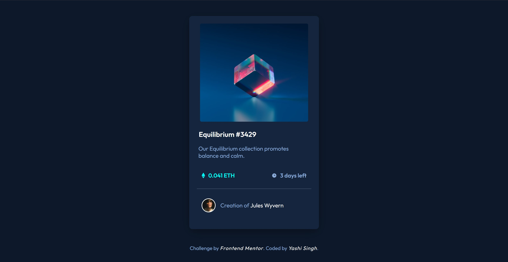

# NFT Preview Card Component

This is a solution to the [NFT preview card component challenge on Frontend Mentor](https://www.frontendmentor.io/challenges/nft-preview-card-component-SbdUL_w0U). Frontend Mentor challenges are designed to help you improve your coding skills by building real-world projects.

## Badges

## Table of contents

- [Overview](#overview)
  - [The challenge](#the-challenge)
  - [Screenshot](#screenshot)
  - [Links](#links)
- [My process](#my-process)
  - [Built with](#built-with)
  - [What I learned](#what-i-learned)
  - [Continued development](#continued-development)
  - [Useful resources](#useful-resources)
- [Style Guide](#style-guide)
- [Author](#author)
- [Acknowledgments](#acknowledgments)

## Overview

### The challenge

Users should be able to:

- View the optimal layout depending on their device's screen size
- See hover states for interactive elements

### Screenshot

### Links

- Solution URL: [URL](https://www.frontendmentor.io/solutions/nft-preview-card-component-LB9QF0SezT)
- Live Site URL: [Live](https://nft-preview-card-component-solutions.netlify.app/)

## My process

### Built with

- Semantic HTML5 markup
- CSS custom properties
- Flexbox
- Mobile-first design
- [Google Fonts](https://fonts.google.com/) - For typography

### What I learned

During this project, I focused on creating a responsive NFT card component. Key takeaways include:

- Implementing hover effects with CSS transitions.
- Utilizing Flexbox for layout and alignment.
- Ensuring responsiveness with media queries.

### Continued development

In future projects, I aim to:

- Explore advanced CSS animations.
- Improve accessibility and semantic HTML usage.
- Experiment with JavaScript frameworks for interactive components.

### Useful resources

- [CSS Tricks: Flexbox Guide](https://css-tricks.com/snippets/css/a-guide-to-flexbox/) - Helpful for understanding Flexbox layout.
- [MDN Web Docs: CSS Transitions](https://developer.mozilla.org/en-US/docs/Web/CSS/CSS_Transitions) - A guide to CSS transitions used in hover effects.

## Style Guide

For the style guidance please refer [Style Guide File](style-guide.md)

## Author

- LinkedIn - [Yashi Singh](https://www.linkedin.com/in/yashi-singh-b4143a246)
- Frontend Mentor - [@Yashi-Singh-9](https://www.frontendmentor.io/profile/Yashi-Singh-9)

## Acknowledgments

A big thank you to Frontend Mentor for providing such a great challenge. I also appreciate the online resources and community forums that helped me enhance my understanding and skills in front-end development.
